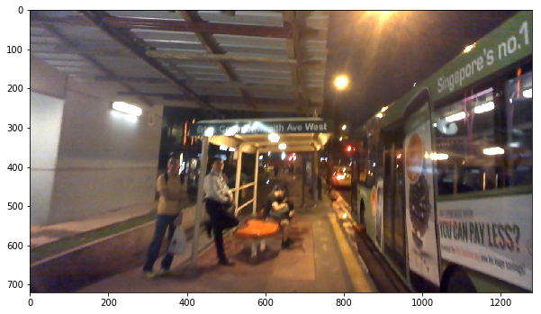
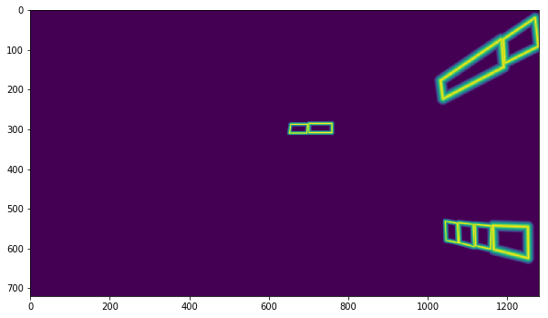
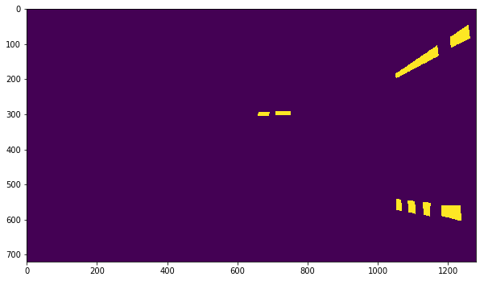
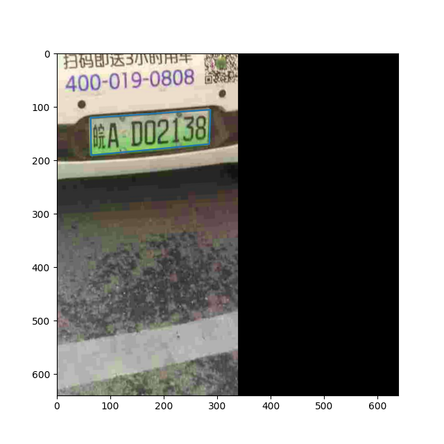
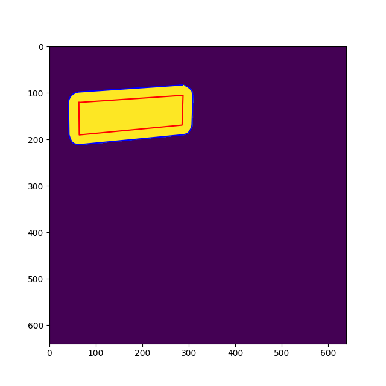
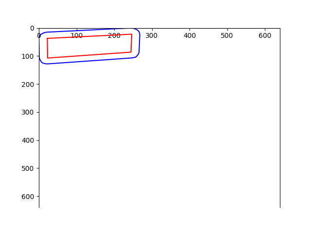
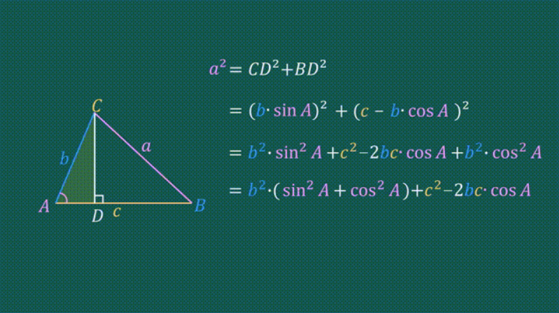
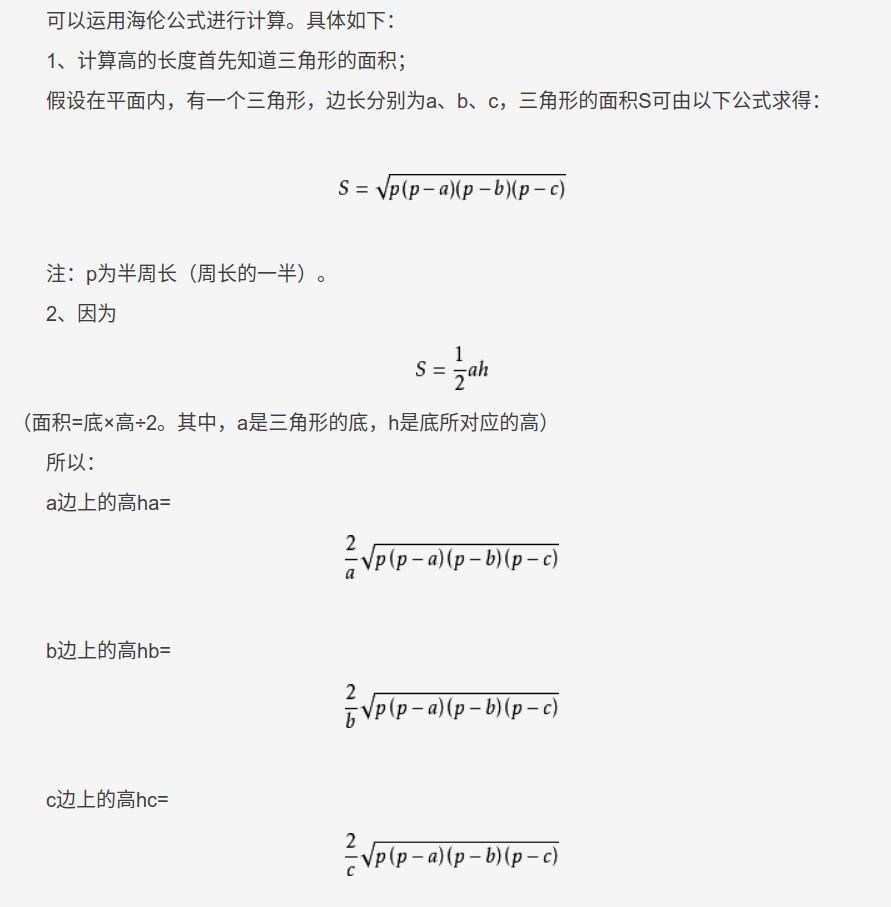

# make_border_map.py代码解析

## 获取阈值图标签
* 使用扩张的方式获取算法训练需要的阈值图标签；
```python
import numpy as np
import cv2

np.seterr(divide='ignore', invalid='ignore')
import pyclipper
from shapely.geometry import Polygon
import sys
import warnings

warnings.simplefilter("ignore")

# 计算文本区域阈值图标签类
# 详细实现代码参考：https://github.com/PaddlePaddle/PaddleOCR/blob/release%2F2.4/ppocr/data/imaug/make_border_map.py
class MakeBorderMap(object):
    def __init__(self,
                 shrink_ratio=0.4,
                 thresh_min=0.3,
                 thresh_max=0.7,
                 **kwargs):
        self.shrink_ratio = shrink_ratio
        self.thresh_min = thresh_min
        self.thresh_max = thresh_max

    def __call__(self, data):

        img = data['image']
        text_polys = data['polys']
        ignore_tags = data['ignore_tags']

        # 1. 生成空模版，用来生成过滤后的真实文本区域的标签
        canvas = np.zeros(img.shape[:2], dtype=np.float32)
        mask = np.zeros(img.shape[:2], dtype=np.float32)

        for i in range(len(text_polys)):
            if ignore_tags[i]:
                continue

            # 2. draw_border_map函数根据解码后的box信息计算阈值图标签
            self.draw_border_map(text_polys[i], canvas, mask=mask)
        canvas = canvas * (self.thresh_max - self.thresh_min) + self.thresh_min

        data['threshold_map'] = canvas
        data['threshold_mask'] = mask
        return data
```
* 显示阈值图标签
```python
# 从PaddleOCR中import MakeBorderMap
from ppocr.data.imaug.make_border_map import MakeBorderMap

# 1. 声明MakeBorderMap函数
generate_text_border = MakeBorderMap()

# 2. 根据解码后的输入数据计算bordermap信息
data = generate_text_border(data)

# 3. 阈值图可视化
plt.figure(figsize=(10, 10))
plt.imshow(src_img)

text_border_map = data['threshold_map']
plt.figure(figsize=(10, 10))
plt.imshow(text_border_map)
```
显示原始图  


显示得到的阈值图  


## 获取概率图标签
* 使用收缩的方式获取算法训练需要的概率图标签；
```python
import numpy as np
import cv2
from shapely.geometry import Polygon
import pyclipper

# 计算概率图标签
# 详细代码实现参考： https://github.com/PaddlePaddle/PaddleOCR/blob/release%2F2.4/ppocr/data/imaug/make_shrink_map.py
class MakeShrinkMap(object):
    r'''
    Making binary mask from detection data with ICDAR format.
    Typically following the process of class `MakeICDARData`.
    '''

    def __init__(self, min_text_size=8, shrink_ratio=0.4, **kwargs):
        self.min_text_size = min_text_size
        self.shrink_ratio = shrink_ratio

    def __call__(self, data):
        image = data['image']
        text_polys = data['polys']
        ignore_tags = data['ignore_tags']

        h, w = image.shape[:2]
        # 1. 校验文本检测标签
        text_polys, ignore_tags = self.validate_polygons(text_polys,
                                                         ignore_tags, h, w)
        gt = np.zeros((h, w), dtype=np.float32)
        mask = np.ones((h, w), dtype=np.float32)

        # 2. 根据文本检测框计算文本区域概率图
        for i in range(len(text_polys)):
            polygon = text_polys[i]
            height = max(polygon[:, 1]) - min(polygon[:, 1])
            width = max(polygon[:, 0]) - min(polygon[:, 0])
            if ignore_tags[i] or min(height, width) < self.min_text_size:
                cv2.fillPoly(mask,
                             polygon.astype(np.int32)[np.newaxis, :, :], 0)
                ignore_tags[i] = True
            else:
                polygon_shape = Polygon(polygon)
                subject = [tuple(l) for l in polygon]
                padding = pyclipper.PyclipperOffset()
                padding.AddPath(subject, pyclipper.JT_ROUND,
                                pyclipper.ET_CLOSEDPOLYGON)
                shrinked = []

                # Increase the shrink ratio every time we get multiple polygon returned back
                possible_ratios = np.arange(self.shrink_ratio, 1,
                                            self.shrink_ratio)
                np.append(possible_ratios, 1)
                # print(possible_ratios)
                for ratio in possible_ratios:
                    # print(f"Change shrink ratio to {ratio}")
                    distance = polygon_shape.area * (
                        1 - np.power(ratio, 2)) / polygon_shape.length
                    shrinked = padding.Execute(-distance)
                    if len(shrinked) == 1:
                        break

                if shrinked == []:
                    cv2.fillPoly(mask,
                                 polygon.astype(np.int32)[np.newaxis, :, :], 0)
                    ignore_tags[i] = True
                    continue

                for each_shrink in shrinked:
                    shrink = np.array(each_shrink).reshape(-1, 2)
                    cv2.fillPoly(gt, [shrink.astype(np.int32)], 1)

        data['shrink_map'] = gt
        data['shrink_mask'] = mask
        return data
```
```python
# 从 PaddleOCR 中 import MakeShrinkMap
from ppocr.data.imaug.make_shrink_map import MakeShrinkMap

# 1. 声明文本概率图标签生成
generate_shrink_map = MakeShrinkMap()

# 2. 根据解码后的标签计算文本区域概率图
data = generate_shrink_map(data)

# 3. 文本区域概率图可视化
plt.figure(figsize=(10, 10))
plt.imshow(src_img)
text_border_map = data['shrink_map']
plt.figure(figsize=(10, 10))
plt.imshow(text_border_map)
```
显示得到的概率图  



## 在本地console控制台终端中代码调试
* 在图像mask中绘制多边形
```python
import matplotlib.pyplot as plt

fig = plt.figure(figsize=(6.4,6.4)) #调整显示窗口尺寸大小640x640
plt.imshow(mask)
# plt.gca().invert_yaxis() #把y轴箭头朝向改为向下，使用了imshow函数则无需执行
plt.plot(padded_polygon[:,0],padded_polygon[:,1],
         color='blue')
plt.plot(np.append(polygon[:,0],polygon[0,0]),
         np.append(polygon[:,1],polygon[0,1]),
         color='red')
# 减去xmin、ymin后
plt.plot(np.append(polygon[:,0],polygon[0,0]),
         np.append(polygon[:,1],polygon[0,1]),
         color='green')
plt.show()
```
* 使用EastRandomCropData数据增强后的效果



* 使用MakeBorderMap模块扩大文本框标签的效果



* 单独绘制多边形封闭曲线，
  把多边形文本框标签映射在新的坐标系下
```python
xmin = padded_polygon[:, 0].min()
xmax = padded_polygon[:, 0].max()
ymin = padded_polygon[:, 1].min()
ymax = padded_polygon[:, 1].max()
width = xmax - xmin + 1
height = ymax - ymin + 1
# 把原始多边形的文本框标签映射在新的坐标系下，
polygon[:, 0] = polygon[:, 0] - xmin
polygon[:, 1] = polygon[:, 1] - ymin
# xs、ys是膨胀的文本区域在新坐标系下的坐标
xs = np.broadcast_to(np.linspace(0, width - 1, num=width).reshape(1, width), (height, width))
ys = np.broadcast_to(np.linspace(0, height - 1, num=height).reshape(height, 1), (height, width))
```
在新坐标系下绘制膨胀的文本框标签以及原始文本框标签
```python
import matplotlib.pyplot as plt

# fig = plt.figure(figsize=(6.4,6.4)) #调整显示窗口尺寸大小640x640
# plt.gca().invert_yaxis() #把y轴箭头朝向改为向下，使用了imshow函数则无需执行
plt.gca().spines['bottom'].set_position(('data',0)) #data表示通过值来设置x轴的位置，将x轴绑定在y=0的位置
plt.gca().set_xlim(0, 640) #设置x、y轴的长度显示范围
plt.gca().set_ylim(0, 640)
plt.gca().invert_yaxis() #把y轴箭头朝向改为向下，使用了imshow函数则无需执行
# 减去xmin、ymin后
plt.plot(np.append(padded_polygon[:,0],padded_polygon[0,0])-xmin,
         np.append(padded_polygon[:,1],padded_polygon[0,1])-ymin,
         color='blue')
plt.plot(np.append(polygon[:,0],polygon[0,0]),
         np.append(polygon[:,1],polygon[0,1]),
         color='red')
plt.show()
```



## _distance函数功能
* 使用了余弦定理来计算xs、ys围成的文本框区域中的每一个点到point_1与point_2连成的直线的距离

* 也可以采用海伦公式计算三角形顶点到边的距离

* 上述两个公式的推导过程类似

```python
absolute_distance = self._distance(xs, ys, polygon[i], polygon[j]) # 分别计算膨胀的文本框标签到原始文本框标签四个边的距离
distance_map[i] = np.clip(absolute_distance / distance, 0, 1) # 只计算膨胀和缩小的边界到原始文本边的距离，
```
膨胀后的文本框区域上的每个点到原始文本框标签的每条边的距离

 
 

* `distance_map = distance_map.min(axis=0)`计算从缩小到膨胀的区域到每条边的最小距离    
此图作为后续计算阈值图的真实值标签的输入  
  


* 最终的画布即阈值图的真实值标签
```python
canvas = canvas * (self.thresh_max - self.thresh_min) + self.thresh_min
```

灰色区域的亮度值为0.3，灰白色区域的亮度值范围是[0.3,0.7]
* 最终的mask即阈值图的mask标签  
在图像mask中绘制原始文本框多边形的真实标签
```python
import matplotlib.pyplot as plt

fig = plt.figure(figsize=(6.4,6.4)) #调整显示窗口尺寸大小640x640
plt.imshow(mask)
# plt.gca().invert_yaxis() #把y轴箭头朝向改为向下，使用了imshow函数则无需执行
plt.plot(np.append(text_polys[0,:,0],text_polys[0,0,0]),
         np.append(text_polys[0,:,1],text_polys[0,0,1]),
         color='red')
plt.show()
```


## 参考链接

* 1 [计算文本框的阈值图与概率图标签](https://aistudio.baidu.com/aistudio/projectdetail/3288900)
* 2 [正弦与余弦的转换公式](https://wenku.baidu.com/view/b0773cc1b307e87101f696de.html)
* 3 []()