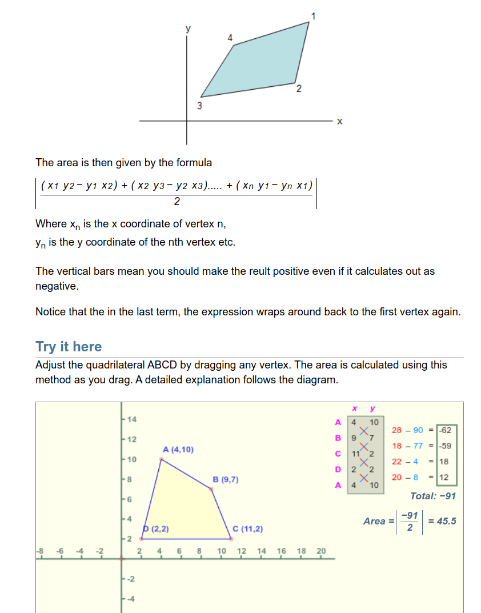

# make_shrink_map.py 代码解析

## `MakeShrinkMap`类解析
1. 计算多边形面积、周长 
2. 按照给定的缩小、放大比例对多边形进行缩小和放大操作

## 在图像中绘制原始文本框真实值标签
```python
import matplotlib.pyplot as plt

fig = plt.figure(figsize=(6.4,6.4)) #调整显示窗口尺寸大小640x640
plt.imshow(image)
# plt.gca().invert_yaxis() #把y轴箭头朝向改为向下，使用了imshow函数则无需执行
plt.plot(np.append(text_polys[0,:,0],text_polys[0,0,0]),
         np.append(text_polys[0,:,1],text_polys[0,0,1]),
         color='red')
plt.show()
```


## 规则多边形面积计算公式
* 圆内接四边形的面积计算公式由海伦公式推导演化而来



## 参考链接
* 1 [规则多边形面积计算公式](https://www.mathopenref.com/coordpolygonarea.html)
* 2 [规则多边形面积计算代码实现](https://www.geeksforgeeks.org/area-of-a-polygon-with-given-n-ordered-vertices/)

