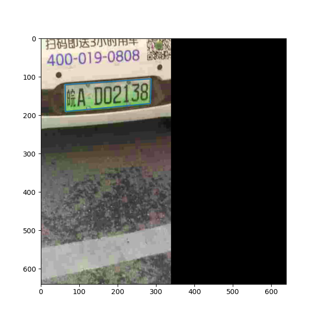

# `random_crop_data.py`代码解析

## `EastRandomCropData`模块随机裁剪
* 裁剪后的代码
```python
data['image'] = img
data['polys'] = np.array(text_polys_crop)
data['ignore_tags'] = ignore_tags_crop
data['texts'] = texts_crop
```
* 使用`plt`显示裁剪后的图像以及文本区域标签
```python
import matplotlib.pyplot as plt

fig = plt.figure(figsize=(6.4,6.4)) #调整显示窗口尺寸大小640x640
plt.imshow(data['image'])
# plt.gca().invert_yaxis() #把y轴箭头朝向改为向下，使用imshow后不用再执行把y轴朝向向下操作
# plt.plot(padded_polygon[:,0],padded_polygon[:,1])
plt.plot(np.append(data['polys'][0,:,0],data['polys'][0,0,0]),
         np.append(data['polys'][0,:,1],data['polys'][0,0,1]))
plt.show()
fig.savefig('/home/amanda/project/algorithm/OCR/PaddleOCR/20211201/PaddleOCR/ppocr/data/imaug/images/EastRandomCropData.png')
# plt.savefig('/home/amanda/project/algorithm/OCR/PaddleOCR/20211201/PaddleOCR/ppocr/data/imaug/images/EastRandomCropData.png')
```

